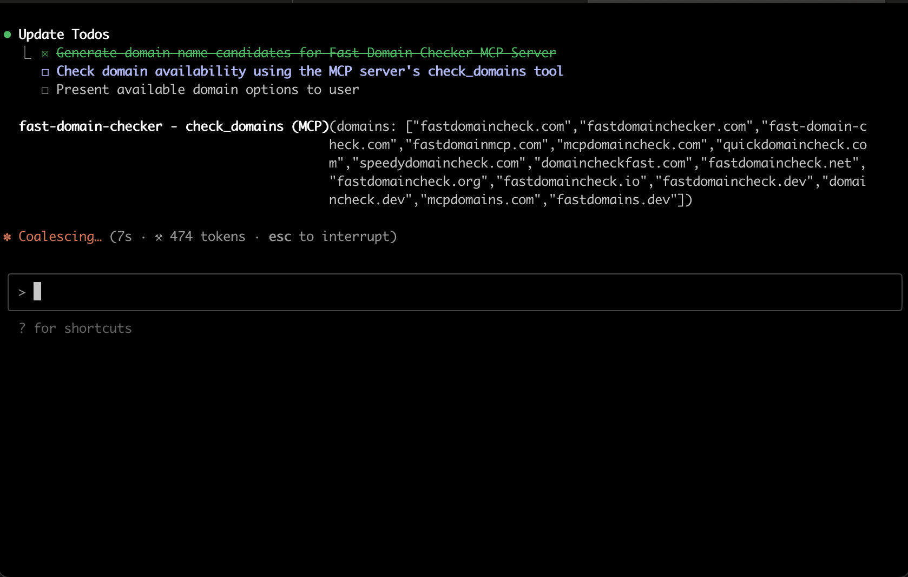
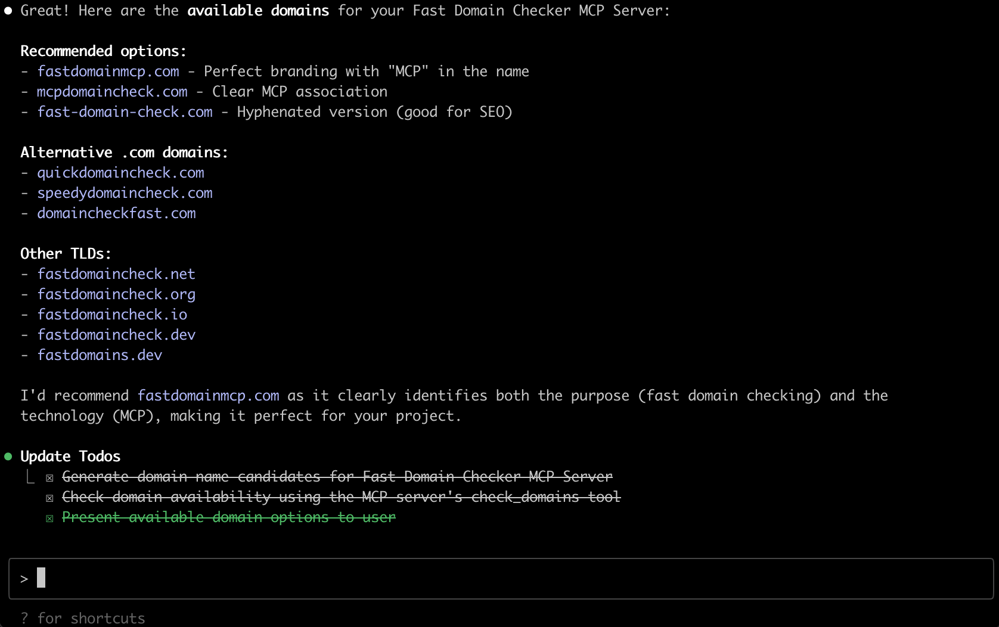

# FastDomainCheck MCP Server

Find Free Domains in a Breeze - A Model Context Protocol (MCP) server for bulk domain name registration status checking.

The screenshots below show the FastDomainCheck MCP Server in action with Claude Code:

### Screen 1: Domain Checking Request


### Screen 2: Domain Checking Results


## Features

- Bulk domain checking (up to 50 domains per request)
- Dual verification: WHOIS queries with DNS fallback
- Support for 200+ TLDs including country codes and IDNs
- Chinese domain name support
- Built-in health check endpoint
- Simple JSON output format

## Installation & Usage

### Claude Code

Add the MCP server directly via npx:

```bash
claude mcp add fast-domain-check -- npx -y fastdomaincheck-mcp-server@latest
```

### Claude Desktop

Add to your Claude Desktop configuration (`claude-desktop-config.json`):

```json
{
  "mcpServers": {
    "fastdomaincheck": {
      "command": "npx",
      "args": ["-y", "fastdomaincheck-mcp-server@latest"]
    }
  }
}
```


## MCP Tool

The server provides one tool:

### check_domains

Check the registration status of multiple domains.

**Input:**
```json
{
  "domains": ["example.com", "test.org", "domain.cn"]
}
```

**Output:**
```json
[
  {
    "domain": "example.com",
    "available": false,
    "method": "whois"
  },
  {
    "domain": "test.org",
    "available": false,
    "method": "whois"
  },
  {
    "domain": "domain.cn",
    "available": true,
    "method": "dns"
  }
]
```

## How It Works

1. **Input Validation**: Validates domain format and length (1-253 characters)
2. **WHOIS Query**: Attempts to query the authoritative WHOIS server for the TLD
3. **DNS Fallback**: If WHOIS fails or is unavailable, checks DNS records
4. **Result Processing**: Returns availability status with the method used

## Performance

- Sequential processing: 0.3-1 second per domain
- 10-second timeout for WHOIS queries
- Automatic fallback to DNS for faster results when WHOIS is slow

## Supported TLDs

Supports 200+ TLDs including:
- Generic TLDs: .com, .net, .org, .info, etc.
- Country codes: .us, .uk, .de, .cn, .jp, etc.
- New gTLDs: .app, .dev, .xyz, etc.
- IDN TLDs: .中国, .公司, .网络, etc.


## License

MIT